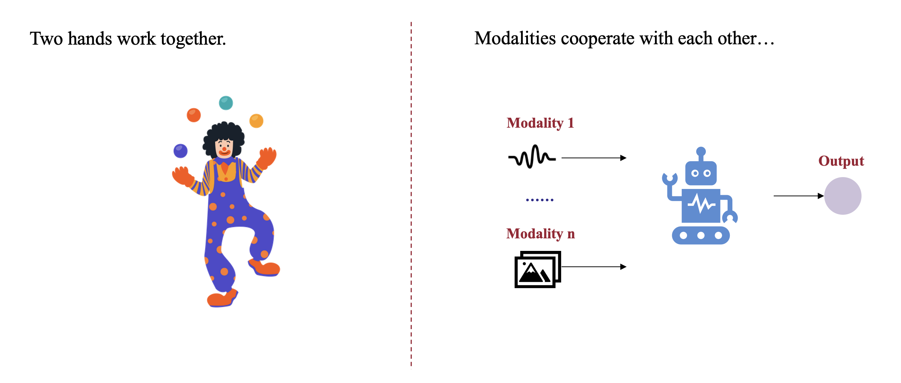
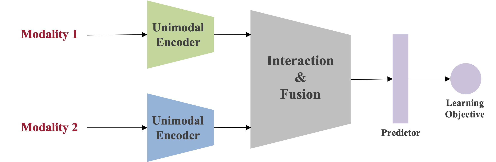
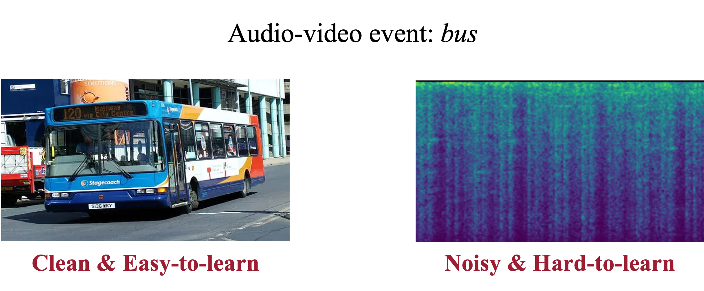
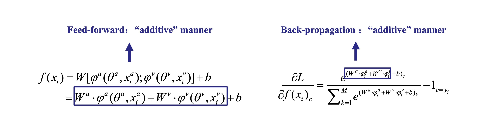

# What is modality imbalance?

In human activities, we often use both hands together to perform a series of actions. For example, a skilled juggler can seamlessly toss objects between their hands in a rhythmic pattern. **This action requires precise coordination between both hands.** However, despite working together, the hands are not always equal in their roles—**most people have a dominant hand.** Right-handed individuals primarily rely on their right hand for control and dexterity, while left-handed individuals depend more on their left hand. This dominance is a natural physiological phenomenon.

If we want to further enhance the coordination between both hands—such as juggling multiple balls effortlessly like a professional performer—it requires extensive practice. Improving the proficiency of the non-dominant hand and refining synchronization between both hands are essential to achieving fluid and precise movements.

Now, let’s draw a parallel with multimodal learning. In a multimodal learning system, multiple modalities serve as inputs, working together within a model to accomplish a shared objective and generate an output. But **do certain modalities take on a dominant role, just like our hands?** And **does this dominant modality similarly suppress the collaborative efficiency of the others?** Through empirical observations and theoretical analysis, the multimodal community has found that the answer is **YES** [[1](https://arxiv.org/abs/2406.19097)][[2](https://arxiv.org/abs/2312.00935)].

<em>Fig 1. Classic multimodal learning paradigm.</em>

As shown in Fig 1, in a classic multimodal learning paradigm, consider the typical case of two modalities. Data from each modality is first processed through its respective encoder to obtain unimodal representations. These representations are then interacted and integrated before being fed into a predictor. The entire multimodal model is optimized based on the learning objective. 

<em>Fig 2. An audio-video event labeled as bus.</em>

Therefore, in the classical multimodal learning paradigm, **we typically train different modalities jointly**. However, we must recognize that **data from different modalities exhibit inherent heterogeneity.** For instance, consider an audio-video pair labeled as *bus* in Fig 2. In the visual modality, the bus is clearly visible, making it relatively easy to learn the concept of bus. In contrast, the audio modality may capture a variety of environmental sounds from the street, which can be noisy and less informative for distinguishing the bus category. **We find that this disparity in learning characteristics across modalities introduces potential challenges for effective multimodal collaboration.**

<em>Fig 3. Unimodal components determine the feed-forward and back-propagation stages in the "additive" manner. Take modality a and v as an example.</em>

The paper [*OGM (Balanced Multimodal Learning via On-the-fly Gradient Modulation)*](https://arxiv.org/pdf/2203.15332) [[3](https://arxiv.org/pdf/2203.15332)] conducted an analysis for the optimization process of classic multimodal joint learning. Here we take two modalities, $a$ and $v$ as an example. Note that this analysis can be extended to $M$ modalities case, which is provided in  *[T-PAMI 2024 paper](https://arxiv.org/abs/2410.11582)* [[4](https://arxiv.org/abs/2410.11582)]. 

Suppose each $x\_{i}$ contains inputs of two modalities: $x\_{i}=(x^{a}\_{i}, x^{v}\_{i})$. $y\_{i} \in \\{1,2,\cdots,C\\}$ is the target label of sample $x\_i$ and $C$ is the number of categories. For modality $m$, where $m \in \\{a,v\\}$, its input is processed by the corresponding encoder $\varphi^{m}(\theta^{m},\cdot)$. $\theta^{m}$ are the parameters of the encoder. After extraction, their features are fused via concatenation (which is one of the most widely used fusion strategies), and passed to a single-layer linear classifier. $W \in \mathbb{R}^{C \times \sum^M\_{m=1} d\_{\varphi^m}}$ and $b \in \mathbb{R}^{C}$ denote the parameters of the linear classifier. $d\_{\varphi^m}$ is the output dimension of $\varphi^{m}(\theta^{m},\cdot)$. Then, we can formulate the multimodal prediction $f(x\_i)$ of the feed-forward stage, and the gradient $\frac{\partial L }{\partial f(x\_{i})\_c}$ as shown in Fig 3.

We can have the following observations:

> **🛠 Key Observations:**
> 
> • In the feed-forward stage, the final output is determined by the "**additive**" combination of unimodal components.
> 
> • In the back-propagation stage, the gradient is also influenced by the "**additive**" combination of unimodal components.

Now, **let's consider the heterogeneity of multimodal data.** 

Suppose one modality—such as the cleaner and easier-to-learn visual modality in the former case—consistently provides higher-quality representations and assigns high confidence to the correct category. Regardless of the other modality's prediction, the final combined result remains correct since the additive combination. 

As a result, **the easier-to-learn modality tends to dominate and control the overall learning dynamics of the multimodal model.** This dominance suppresses the optimization of other modalities, leading to underutilization. Ultimately, this imbalance limits the full potential of the multimodal model, highlighting the critical challenge of achieving **balanced multimodal learning**.

# How to alleviate modality imbalance?

].](image%201.png)

<em>Fig 4. The taxonomy of methods for multimodal imbalance learning. This figure is from <a href="https://arxiv.org/abs/2502.10816">[5]</a>.</em>

After identifying the problem, the next step is to explore potential solutions. For this fundamental challenge of modality imbalance, the goal is not merely to design a specific model architecture. Instead, attention has gradually shifted toward different stages of the training process, with the aim of developing algorithms that are transferable across a wide range of multimodal learning scenarios.

To provide a clearer understanding of existing solutions, we categorize representative methods into four key stages of multimodal training: **Data input, Feed-forward**, **Learning objective, and Optimization**, as illustrated in Fig 4. The following sections provide a detailed discussion of approaches within each category.

## Data input

**The quality of multimodal data is crucial for effective multimodal learning.** However, for any given multimodal sample (e.g., a data point composed of visual and audio modalities), there often exists a disparity in the quality or informativeness between the constituent modalities. This disparity can cause the model to develop a preference for the modality that is easier to learn, which subsequently tends to dominate the overall learning dynamics and suppress the optimization of other modalities.

].](sample-level.png)

<em>Fig 5. An illustration of sample-level discrepancies between modalities. This figure is from <a href="https://arxiv.org/abs/2309.06255">[6]</a>.</em>

Imagine a video and audio clip describing a motorcycle; the amount of information contained in each modality can differ significantly. For example, as shown in Fig. 5\(a\), the image itself contains very limited information, while in Fig. 5\(b\), the visual clearly shows a motorcycle wheel. This per-sample information disparity leads to varying contributions to model prediction. As illustrated in Fig. 5\(c\), when the visual modality carries little information (Fig. 5\(a\)), the model tends to rely more on the audio modality, whereas when the visual modality is informative (Fig. 5\(b\)), the model is more inclined to rely on visual cues.

To address the imbalance originating from this *sample-level quality disparity*, the work [*Enhancing Multimodal Cooperation via Sample-level Modality Valuation*](https://arxiv.org/abs/2309.06255) [[6](https://arxiv.org/abs/2309.06255)] proposes a targeted solution. The key insight is to shift the focus from a "macro" or *dataset-level* view of data quality to a fine-grained *sample-level* perspective. The approach first introduces a valuation metric grounded in the Shapley value from game theory to precisely measure the contribution of each modality for every individual sample. Once the modality with a lower contribution is identified for a specific sample, a targeted re-sampling strategy is employed. This provides focused, additional training for the deficient modality, compensating for its initial lack of informativeness and thereby promoting a more balanced and effective multimodal collaboration.

## Feed-forward

Adjustments during the feed-forward stage determine how a multimodal model perceives and integrates information from different modalities during prediction.  

A number of studies intervene at this stage to **enhance the processing of information from weaker modalities**, thereby mitigating the dominance of stronger ones in multimodal learning [[4](https://arxiv.org/abs/2410.11582)].

For example,  *[Multimodal Learning with Alternating Unimodal Adaptation (MLA)](https://arxiv.org/abs/2311.10707)* [[7](https://arxiv.org/abs/2311.10707)] directly addresses modality imbalance by altering the **feed-forward stage** during training. Instead of a conventional feed-forward pass where inputs from all modalities are processed jointly, MLA's *alternating unimodal learning* framework constrains each feed-forward operation to a single modality at a time. In any given training step, the network *sees and computes* an output based on only one data stream, which prevents signals from dominant modalities from interfering with or suppressing weaker ones. This isolated feed-forward process ensures a more balanced representation is learned before backpropagation, while a supporting gradient modification technique ensures the shared classifier doesn't forget previously seen modalities.
Apart from MLA, several other methods also intervene at the feed-forward stage to tackle modality imbalance. For instance, [*Adaptive Mask Co-optimization (AMCo)*](https://ieeexplore.ieee.org/document/10096641) [[8](https://ieeexplore.ieee.org/document/10096641)] dynamically masks features of the dominant modality, while [*On-the-fly Prediction Modulation (OPM)*](https://arxiv.org/abs/2410.11582) [[4](https://arxiv.org/abs/2410.11582)] drops some of the dominant modality's features. Meanwhile, [*Greedy*](https://arxiv.org/abs/2202.05306) [[9](https://arxiv.org/abs/2202.05306)] enhances multimodal fusion by leveraging the MMTM architecture to facilitate better modality interaction.

## Learning objective

Whether from the perspective of data input or the feed-forward stage, these approaches focus on adjusting multimodal information before or during its entry into the model. However, they do not explicitly encourage the model to move toward modality balance during the update. In contrast, another group of methods [[10](https://arxiv.org/abs/2405.17730)] [[11](https://www.notion.so/Balanced-multimodal-learning-26b8de78fa28807ebfcfd5a625532c65?pvs=21)] [[12](https://dl.acm.org/doi/10.1145/3539597.3570423)] [[13](https://arxiv.org/abs/2306.01265)] [[14](https://jiangqy.github.io/publications/NeurIPS2024_LFM.pdf)] [[15](https://arxiv.org/abs/2305.01233)] [[16](https://arxiv.org/abs/1905.12681)] focuses on the learning objective itself  to alleviate modality imbalance.

One representative example of learning objective–level intervention is [*MMPareto (Boosting Multimodal Learning with Innocent Unimodal Assistance)*](https://arxiv.org/abs/2405.17730) [[10](https://arxiv.org/abs/2405.17730)]. Unlike previous methods that adjust the input data or modify how the model processes different modalities during the feed-forward stage, MMPareto focuses directly on **how the model updates its parameters** , that is, on the learning objective itself.

].](image%202.png)

<em>Fig 6. Illustration of multimodal framework and gradient integration strategy of MMPareto <a href="https://arxiv.org/abs/2405.17730">[8]</a>.</em>

A standard multimodal model is often trained with a single, shared objective function that evaluates performance after all modalities have been fused. However, to better supervise each modality's representation and prevent weaker ones from being neglected, some methods enhance this setup. They adopt a multitask-like framework, as depicted in Figure 6, which supplements the main multimodal objective with separate objectives for each individual modality (unimodal). While this helps weaker modalities learn better, it also creates a potential problem: the optimization goals of these different losses can conflict with each other. For example, the model might receive contradictory signals from the multimodal and unimodal objectives, leading to unstable or suboptimal training.

MMPareto addresses this by carefully analyzing and combining these gradients (the directions in which the model updates its parameters). It draws inspiration from *Pareto optimization*, a technique that aims to find a balance when optimizing multiple goals. Specifically, MMPareto ensures that the final update direction benefits both the multimodal and unimodal objectives without letting one overpower the other. At the same time, it *adjusts the strength of these updates* to help the model learn more generalizable patterns and avoid overfitting.

In simple terms, instead of just telling the model “learn from both objectives,” MMPareto tells it **how to learn from both in a coordinated and balanced way**. 

In addition to MMPareto, several other methods also tackle modality imbalance by adjusting the learning objective. For example, [*Multimodal Cosine Loss (MMCosine)*](https://arxiv.org/abs/2303.05338#:~:text=Fueled%20by%20the%20success%20of%20cosine%20loss%20that,variability%2C%20this%20paper%20proposes%20Multi-Modal%20Cosine%20loss%2C%20MMCosine.) [[11](https://www.notion.so/Balanced-multimodal-learning-26b8de78fa28807ebfcfd5a625532c65?pvs=21)] introduces a multimodal cosine loss to reduce the gap in weight norms between different modalities and applies inter-symmetric constraints to encourage balanced and collaborative learning. [*MBSD*](https://dl.acm.org/doi/10.1145/3539597.3570423) [[12](https://dl.acm.org/doi/10.1145/3539597.3570423)] adopts a knowledge distillation framework, transferring the knowledge (predicted probability distributions and high-level representations) learned by the dominant modality to the weaker one. [*Calibrating Multimodal Learning (CML)*](https://arxiv.org/abs/2306.01265) [[13](https://arxiv.org/abs/2306.01265)] introduces a confidence loss for each modality, reducing the confidence of the dominant modality to alleviate imbalance. [*LFM*](https://jiangqy.github.io/publications/NeurIPS2024_LFM.pdf) [[14](https://jiangqy.github.io/publications/NeurIPS2024_LFM.pdf)] incorporates contrastive learning losses for each modality to mitigate differences in their ability to fit category labels, thereby addressing the imbalance at the supervision level.

Another related line of work enhances multimodal learning by introducing unimodal-specific training objectives. [*Uni-Modal Teacher (UMT)*](https://arxiv.org/abs/2305.01233) [[15](https://arxiv.org/abs/2305.01233)] distills unimodal feature-level outputs from standalone unimodal models into the corresponding unimodal branches within the multimodal model, helping each modality learn more effectively. [*Gradient-Blending (GBlending)*](https://arxiv.org/abs/1905.12681) [[16](https://arxiv.org/abs/1905.12681)] dynamically calculates optimal fusion weights based on the overfitting behavior of each modality, guiding the model's training accordingly.

## Optimization

Beyond modifying the data input, feed-forward process, or learning objectives, another important direction focuses on **optimization itself.** Specifically, adjusting how gradients from different modalities are handled during training. These *gradient-based strategies* aim to ensure that each modality receives an appropriate learning signal, rather than being overpowered by stronger modalities during backpropagation.

A representative method in this category is [*On-the-fly Gradient Modulation (OGM)*](https://arxiv.org/pdf/2203.15332) [[3](https://arxiv.org/pdf/2203.15332)]. This method is based on a key observation. As shown in Fig 3, the gradients associated with weaker modalities tend to be suppressed during training, largely because the dominant modality's high-confidence predictions (i.e., higher logits) overshadow them. As a result, weaker modalities receive fewer meaningful updates and struggle to improve. OGM addresses this by **slowing down the gradient updates of dominant modalities**, effectively allowing the weaker ones to "catch up."

].](image%203.png)

<em>Fig 7. The pipeline of the On-the-fly Gradient Modulation strategy <a href="https://arxiv.org/pdf/2203.15332">[3]</a>.</em>

To do this, OGM dynamically monitors the *discrepancy between modalities’ contributions* to the prediction at each training step. If one modality (e.g., audio) consistently produces more confident predictions than the other (e.g., visual), OGM interprets it as being over-optimized. It then applies a *modulation factor* to scale down that modality’s gradient before the model updates its parameters.

This ensures that the underperforming modality receives relatively stronger gradient signals, giving it more opportunity to improve. Importantly, this is done without changing the model architecture or requiring additional modules, and the entire process happens "on the fly" during training.

However, reducing gradients can also weaken the beneficial randomness (i.e., stochastic noise) that helps models generalize well. To counteract this, OGM introduces *Gaussian noise* into the training process. This Generalization Enhancement (GE) step restores and even boosts the model’s ability to generalize to unseen data, ensuring that balancing the modalities doesn’t come at the cost of performance.

Building upon *OGM*, [*AGM*](https://arxiv.org/abs/2308.07686) [[17](https://arxiv.org/abs/2308.07686)] incorporates a Shapley value-based method to estimate the contribution of each modality and adjusts the gradient magnitudes accordingly. [*Prototypical Modality Rebalance (PMR)*](https://www.notion.so/Balanced-multimodal-learning-26b8de78fa28807ebfcfd5a625532c65?pvs=21) [[18](https://www.notion.so/Balanced-multimodal-learning-26b8de78fa28807ebfcfd5a625532c65?pvs=21)] modulates gradient strength based on category prototypes, thereby accelerating the learning process of weak modalities. [*InfoReg*](https://arxiv.org/abs/2503.18595) [[19](https://arxiv.org/abs/2503.18595)] identifies the different rates at which the model acquires information from each modality and constrains the gradient updates of dominant modalities at the batch level. By regulating the Fisher information of dominant modalities it helps to reduce imbalance during training.

In addition to gradient-based approaches, some methods adopt other optimization strategies to alleviate multimodal imbalance. [*ReconBoost*](https://arxiv.org/abs/2405.09321) [[20](https://arxiv.org/abs/2405.09321)] introduces the idea of boosting, a traditional technique in machine learning, as an optimization paradigm to enhance unimodal performance and, in turn, mitigate imbalance. [*Diagnosing & Re-learning (Relearning)*](https://arxiv.org/abs/2407.09705) [[21](https://arxiv.org/abs/2407.09705)] adopts a re-initialization policy to reduce over-dependence on dominant modalities while preventing weaker ones from overfitting to noise.

# Further work related to multimodal imbalance

The problem of modality imbalance in multimodal learning has been extensively studied from multiple perspectives, including **Data input**, **Feed-forward**, **Learning objective**, and **Optimization**. However, all of these approaches are developed within the paradigm of conventional multimodal learning frameworks. Recent research has begun to extend the study of modality imbalance to broader and more complex settings.

### Benchmark

To systematically evaluate and compare different approaches for multimodal imbalance, [*BalanceBenchmark*](https://arxiv.org/pdf/2502.10816v2) [[5](https://arxiv.org/pdf/2502.10816v2)] has been introduced. This benchmark consolidates numerous existing methods and datasets, providing a unified coding framework that facilitates fair comparison and reproducibility. However, further large-scale experiments are needed, especially on Transformer-based encoder architectures, which are now prevalent. Additionally, more investigation into extreme imbalance scenarios, where one modality is significantly weaker or noisier than the others, should be conducted to test the boundaries of current methods.

### Modality imbalance in Transformer

[*RollingQ*](https://arxiv.org/abs/2506.11465) [[22](https://arxiv.org/abs/2506.11465)] identifies that when using Transformers for dynamic multimodal fusion, the model tends to favor certain modalities over others, assigning them higher attention scores and larger gradients during backpropagation. To address this imbalance, *RollingQ* proposes a method called *rotating the query*, which disrupts the existing modality preference. This technique rebalances attention allocation, gives underrepresented modalities more opportunity to be optimized, and ultimately revives cooperative learning dynamics between modalities.

### Modality imbalance in MLLMs

With the recent surge of interest in multimodal large models (MLLMs), a number of studies have begun to highlight the persistence of modality imbalance issues in this new context [[23](https://arxiv.org/abs/2405.09818)] [[24](https://arxiv.org/abs/2506.05191)] [[25](https://arxiv.org/pdf/2407.12580)] [[26](https://arxiv.org/pdf/2505.20873)] [[27](https://arxiv.org/abs/2501.02669)]. For instance, the work [*Chameleon*](https://arxiv.org/abs/2405.09818) [[23](https://arxiv.org/abs/2405.09818)] points out that competition naturally arises between modalities within large-scale multimodal model architectures. Some other studies [[24](https://arxiv.org/abs/2506.05191)] [[25](https://arxiv.org/pdf/2407.12580)] [[26](https://arxiv.org/pdf/2505.20873)] have begun to address this imbalance at the **token level**. A representative example is [*MokA*](https://arxiv.org/abs/2506.05191) [[24](https://arxiv.org/abs/2506.05191)], which observes a strong reliance on the text modality during parameter-efficient fine-tuning (PEFT) and proposes leveraging attention mechanisms to selectively extract highly correlated information from other modalities, thereby improving performance.

These works collectively demonstrate that modality imbalance remains a prevalent issue under current MLLMs framework. Since large language models (LLMs) often serve as the backbone of MLLMs, the text modality inherently becomes the dominant modality during training. In this context, future work should not only continue exploring modality-specific adjustments within the existing MLLMs framework, but also critically examine whether the framework itself is well-suited for fostering balanced multimodal intelligence and whether it can truly serve as the foundation for achieving artificial general intelligence (AGI).

# Future research direction questions

1. While [*BalanceBenchmark*](https://arxiv.org/pdf/2502.10816v2) [[5](https://arxiv.org/pdf/2502.10816v2)] introduced the concept of "relative balance" (i.e., a trade-off point between performance and balance), it really gets us thinking: Does the blind pursuit of modality balance always pay off? Is this "relative balance" the same as "true balance"? And most importantly, how do we find that sweet spot in practice?
2. Can we design a novel fusion architecture for multimodal large models that does not rely on a single dominant modality, especially text?
3. Does a more equitable fusion mechanism exist that allows different modalities to interact more deeply and non-hierarchically at higher levels of the model, rather than simply "translating" visual or auditory information into textual concepts?
4. How can we design new Parameter-Efficient Fine-Tuning (PEFT) methods that can balance updating and utilize information from all modalities during the fine-tuning process, rather than focusing only on text-related components? ([*MokA*](https://arxiv.org/abs/2506.05191) [[24](https://arxiv.org/abs/2506.05191)] has made some efforts!)
5. How can we design a comprehensive evaluation benchmark for multimodal large models specifically to measure the contribution of different modalities and the model's modality preferences?
6. Can we develop explainability tools to visualize and analyze how information flows, fuses, and is ultimately utilized across modalities within a multimodal large model, thereby precisely identifying the bottlenecks of imbalance?
7. In the progression towards AGI, how should a model learn to autonomously adjust its reliance on different modalities according to task demands to achieve true synergy and complementarity?

### **Join our discussion**

If you're interested in multimodal imbalance and want to dive deeper into the discussion, we welcome you to join our community:

**GitHub:** https://github.com/GeWu-Lab/awesome-balanced-multimodal-learning

**Slack Channel:** [https://join.slack.com/t/balancedmulti-mhs9373/shared_invite/zt-3aj46comq-CNWrkqqGI9Z2kNn64aU9FQ](https://join.slack.com/t/balancedmulti-mhs9373/shared_invite/zt-3aj46comq-CNWrkqqGI9Z2kNn64aU9FQ)

# References

[1] Adewumi, T., Alkhaled, L., Gurung, N., van Boven, G., & Pagliai, I. (2024). Fairness and bias in multimodal ai: A survey. <em>arXiv preprint arXiv:2406.19097</em>.

[2] Zhang, Y., & Latham, P. (2024, July). Understanding Unimodal Bias in Multimodal Deep Linear Networks. In <em>Proceedings of the 41st International Conference on Machine Learning</em> (Vol. 235). PMLR.

[3] Peng, X., Wei, Y., Deng, A., Wang, D., & Hu, D. (2022). Balanced multimodal learning via on-the-fly gradient modulation. In <em>Proceedings of the IEEE/CVF Conference on Computer Vision and Pattern Recognition</em> (pp. 8238-8247).

[4] Wei, Y., Hu, D., Du, H., & Wen, J. R. (2024). On-the-fly modulation for balanced multimodal learning. <em>IEEE Transactions on Pattern Analysis and Machine Intelligence</em>.

[5] Xu, S., Cui, M., Huang, C., Wang, H., & Hu, D. (2025). Balancebenchmark: A survey for multimodal imbalance learning. <em>arXiv preprint arXiv:2502.10816</em>.

[6] Wei, Y., Feng, R., Wang, Z., & Hu, D. (2024). Enhancing multimodal cooperation via sample-level modality valuation. In <em>Proceedings of the IEEE/CVF Conference on Computer Vision and Pattern Recognition</em> (pp. 27338-27347).

[7] Zhang, X., Yoon, J., Bansal, M., & Yao, H. (2024). Multimodal representation learning by alternating unimodal adaptation. In <em>Proceedings of the IEEE/CVF Conference on Computer Vision and Pattern Recognition</em> (pp. 27456-27466).

[8] Zhou, Y., Liang, X., Zheng, S., Xuan, H., & Kumada, T. (2023, June). Adaptive mask co-optimization for modal dependence in multimodal learning. In <em>ICASSP 2023-2023 IEEE International Conference on Acoustics, Speech and Signal Processing (ICASSP)</em> (pp. 1-5). IEEE.

[9] Wu, N., Jastrzebski, S., Cho, K., & Geras, K. J. (2022, June). Characterizing and overcoming the greedy nature of learning in multi-modal deep neural networks. In <em>International Conference on Machine Learning</em> (pp. 24043-24055). PMLR.

[10] Wei, Y., & Hu, D. (2024, July). MMPareto: boosting multimodal learning with innocent unimodal assistance. In <em>Proceedings of the 41st International Conference on Machine Learning</em> (pp. 52559-52572).

[11] Xu, R., Feng, R., Zhang, S. X., & Hu, D. (2023, June). Mmcosine: Multi-modal cosine loss towards balanced audio-visual fine-grained learning. In <em>ICASSP 2023-2023 IEEE International Conference on Acoustics, Speech and Signal Processing (ICASSP)</em> (pp. 1-5). IEEE.

[12] Liu, S., Li, L., Song, J., Yang, Y., & Zeng, X. (2023, February). Multimodal pre-training with self-distillation for product understanding in e-commerce. In <em>Proceedings of the Sixteenth ACM International Conference on Web Search and Data Mining</em> (pp. 1039-1047).

[13] Ma, H., Zhang, Q., Zhang, C., Wu, B., Fu, H., Zhou, J. T., & Hu, Q. (2023, July). Calibrating multimodal learning. In <em>International Conference on Machine Learning</em> (pp. 23429-23450). PMLR.

[14] Yang, Y., Wan, F., Jiang, Q. Y., & Xu, Y. (2024). Facilitating multimodal classification via dynamically learning modality gap. <em>Advances in Neural Information Processing Systems</em>, <em>37</em>, 62108-62122.

[15] Du, C., Teng, J., Li, T., Liu, Y., Yuan, T., Wang, Y., ... & Zhao, H. (2023, July). On uni-modal feature learning in supervised multi-modal learning. In <em>International Conference on Machine Learning</em> (pp. 8632-8656). PMLR.

[16] Wang, W., Tran, D., & Feiszli, M. (2020). What makes training multi-modal classification networks hard?. In <em>Proceedings of the IEEE/CVF Conference on Computer Vision and Pattern Recognition</em> (pp. 12695-12705).

[17] Li, H., Li, X., Hu, P., Lei, Y., Li, C., & Zhou, Y. (2023). Boosting multi-modal model performance with adaptive gradient modulation. In <em>Proceedings of the IEEE/CVF International Conference on Computer Vision</em> (pp. 22214-22224).

[18] Fan, Y., Xu, W., Wang, H., Wang, J., & Guo, S. (2023). Pmr: Prototypical modal rebalance for multimodal learning. In <em>Proceedings of the IEEE/CVF Conference on Computer Vision and Pattern Recognition</em> (pp. 20029-20038).

[19] Huang, C., Wei, Y., Yang, Z., & Hu, D. (2025). Adaptive unimodal regulation for balanced multimodal information acquisition. In <em>Proceedings of the Computer Vision and Pattern Recognition Conference</em> (pp. 25854-25863).

[20] Hua, C., Xu, Q., Bao, S., Yang, Z., & Huang, Q. (2024, July). ReconBoost: Boosting Can Achieve Modality Reconcilement. In <em>International Conference on Machine Learning</em> (pp. 19573-19597). PMLR.

[21] Wei, Y., Li, S., Feng, R., & Hu, D. (2024, September). Diagnosing and re-learning for balanced multimodal learning. In <em>European Conference on Computer Vision</em> (pp. 71-86). Cham: Springer Nature Switzerland.

[22] Ni, H., Wei, Y., Liu, H., Chen, G., Peng, C., Lin, H., & Hu, D. RollingQ: Reviving the Cooperation Dynamics in Multimodal Transformer. In <em>Forty-second International Conference on Machine Learning</em>.

[23] Team, C. (2024). Chameleon: Mixed-modal early-fusion foundation models. <em>arXiv preprint arXiv:2405.09818</em>.

[24] Wei, Y., Miao, Y., Zhou, D., & Hu, D. (2025). MokA: Multimodal Low-Rank Adaptation for MLLMs. In <em>Advances in Neural Information Processing Systems</em> (NeurIPS).

[25] Jiang, T., Song, M., Zhang, Z., Huang, H., Deng, W., Sun, F., ... & Zhuang, F. (2024). E5-V: Universal Embeddings with Multimodal Large Language Models. <em>CoRR</em>.

[26] Jung, C., Jang, Y., Choi, J., & Chung, J. S. (2025). Fork-Merge Decoding: Enhancing Multimodal Understanding in Audio-Visual Large Language Models. <em>arXiv preprint arXiv:2505.20873</em>.

[27] Park, S., Panigrahi, A., Cheng, Y., Yu, D., Goyal, A., & Arora, S. Generalizing from SIMPLE to HARD Visual Reasoning: Can We Mitigate Modality Imbalance in VLMs?. In <em>Forty-second International Conference on Machine Learning</em>.